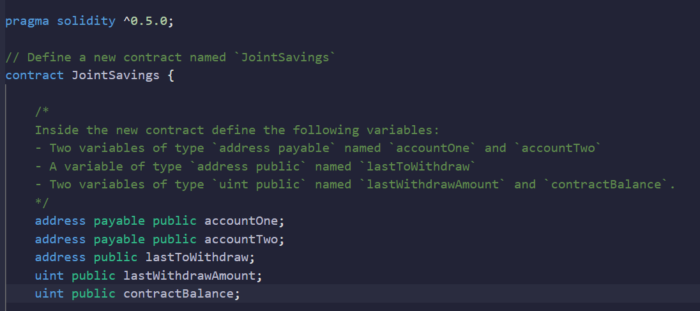
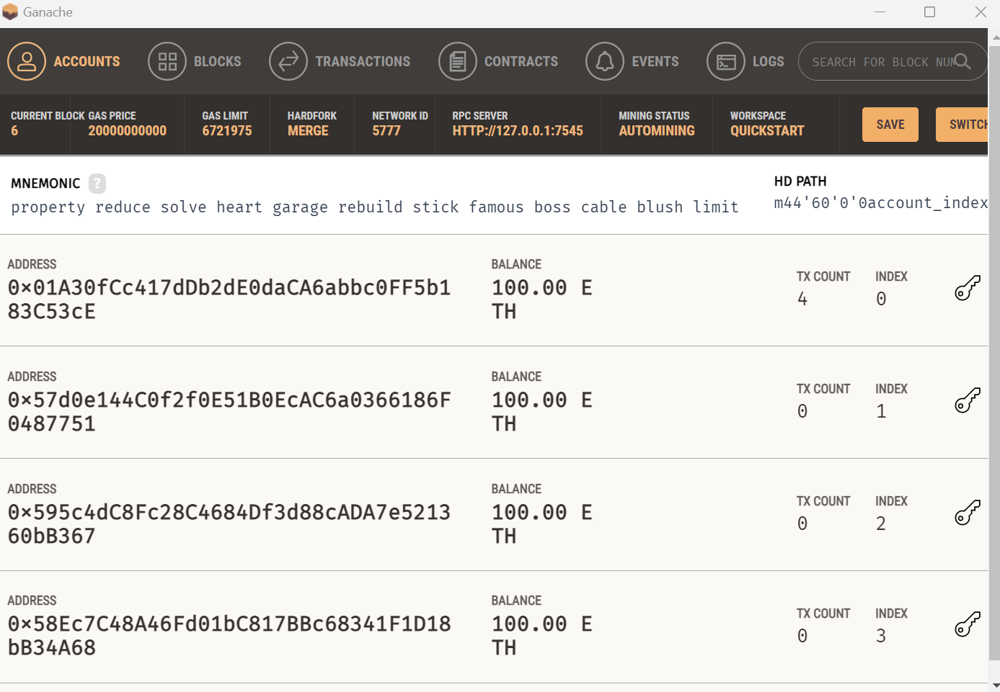
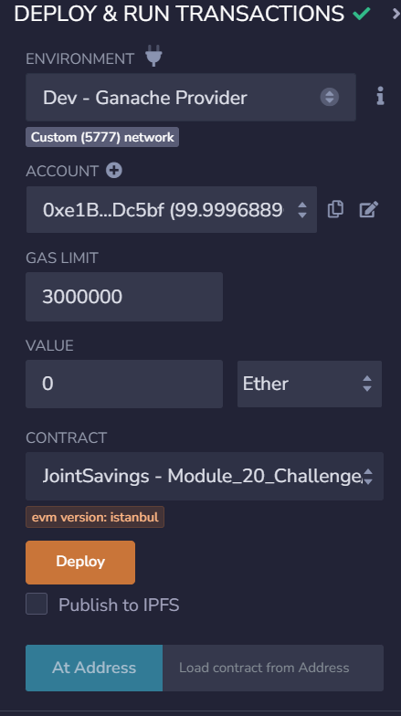
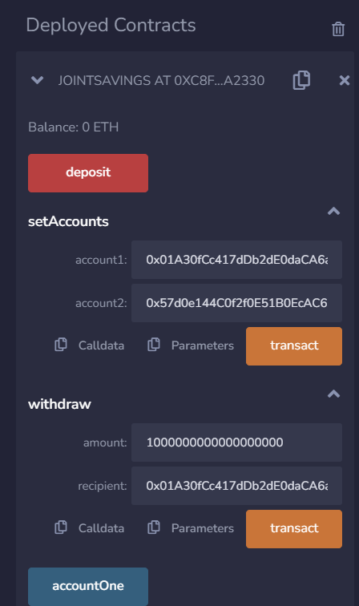

# Module_20_Challenge

#Solidity smart contract

Hello, this project is to automate the creation of joint savings accounts create a Solidity smart contract that accepts two user addresses.Solidity is an object-oriented programming language created specifically by the Ethereum Network team for constructing and designing smart contracts on Blockchain platforms. It's used to create smart contracts that implement business logic and generate a chain of transaction records in the blockchain system.

---

## Technologies

Solidity is a high-level programming language specifically designed for writing smart contracts on blockchain platforms, with Ethereum being the most prominent one. Smart contracts are self-executing contracts with the terms of the agreement directly written into code. Solidity was created to enable developers to build decentralized applications (DApps) and automate complex processes on blockchain networks.

## Installation Guide

Import the correct packages to begin coding.

---

## Usage

Use Plots and data frame to get the correct portfolio

---

## Contributors

-Name: John Nguyen
-Email: nguyenjohn1337@gmail.com

---

## License

Specify the details of your project’s license - that is, how others can or cannot use your code and files.
